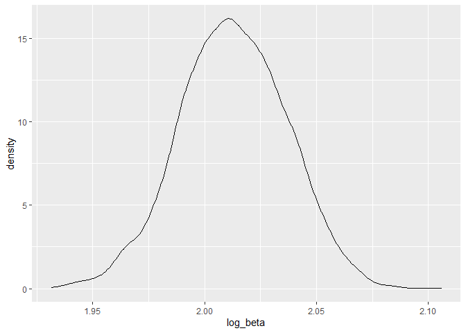

p8105\_hw6\_js5095
================
Jianting Shi
2020-12-09

``` r
library(tidyverse)
```

    ## -- Attaching packages --------------------------------- tidyverse 1.3.0 --

    ## v ggplot2 3.3.2     v purrr   0.3.4
    ## v tibble  3.0.3     v dplyr   1.0.2
    ## v tidyr   1.1.2     v stringr 1.4.0
    ## v readr   1.4.0     v forcats 0.5.0

    ## -- Conflicts ------------------------------------ tidyverse_conflicts() --
    ## x dplyr::filter() masks stats::filter()
    ## x dplyr::lag()    masks stats::lag()

``` r
library(MASS)
```

    ## Warning: package 'MASS' was built under R version 4.0.3

    ## 
    ## Attaching package: 'MASS'

    ## The following object is masked from 'package:dplyr':
    ## 
    ##     select

``` r
library(modelr)
library(rnoaa)
```

    ## Warning: package 'rnoaa' was built under R version 4.0.3

    ## Registered S3 method overwritten by 'hoardr':
    ##   method           from
    ##   print.cache_info httr

# Problem 2

### Load and clean the data for regression analysis

``` r
# Load data and clean
bw_df = 
  read_csv("./data/birthweight.csv")%>%
  janitor::clean_names() %>% 
  mutate(babysex = as.factor(babysex),
         frace=as.factor(frace),
         malform = as.factor(malform),
         mrace = as.factor(mrace))
```

    ## 
    ## -- Column specification --------------------------------------------------
    ## cols(
    ##   .default = col_double()
    ## )
    ## i Use `spec()` for the full column specifications.

### Propose a regression model for birthweight on a data-driven model-building process

``` r
# Use step-wise model selection to provide a data-driven model
full_model = lm(bwt ~., bw_df)
step_model = stepAIC(full_model,
                     direction = "both",
                     trace = FALSE)

#summary(step_model)

#formula(step_model)

#step_model %>% broom::tidy()

# Add predictions and residuals
bw_df = bw_df %>%
  modelr::add_predictions(step_model) %>% 
  modelr::add_residuals(step_model)
```

Describe your modeling process： I applied a classic method, stepwise
regression, to identify the optimal linear model from a collection of
predictors. I started with the full model (using all variables as
predictors), and instructed the algorithm to apply stepwise regression
based on AIC. The resulting model has 13 predictors.

### Create a plot of model residuals against fitted values

``` r
# Create residuals & prediction plots
bw_df %>%
  ggplot(aes(x = resid, y = pred)) + geom_point()
```

<!-- -->
Describe the plots: The predictions center around 3000, whereas the
residuals center around 0. There are a few outliers in prediction, as
the predicted birthweights are negative.

### Make comparison with two other models in terms of the cross-validated prediction error

``` r
# Create two other models
model_1 = lm(bwt ~ blength + gaweeks, data=bw_df)
model_2 = lm(bwt ~ bhead*blength*babysex, data=bw_df )

# Cross validation
set.seed(345)
cv_bw_df = 
  crossv_mc(bw_df, 100) %>%
  mutate(
    train = map(train, as_tibble),
    test = map(test, as_tibble)
  )

cv_bw_df = 
  cv_bw_df %>%
  mutate(
    step_mod = map(train, ~lm(formula(step_model), data=.x)),
    model_1 = map(train, ~lm(bwt ~ blength + gaweeks, data=.x)),
    model_2 = map(train, ~lm(bwt ~ bhead*blength*babysex, data=.x))
  ) %>%
  mutate(
    rmse_step_mode = map2_dbl(step_mod, test, ~rmse(model = .x, data = .y)),
    rmse_model_1 = map2_dbl(model_1, test, ~rmse(model = .x, data = .y)),
    rmse_model_2 = map2_dbl(model_2, test, ~rmse(model = .x, data = .y)),
  )
```

    ## Warning: Problem with `mutate()` input `rmse_step_mode`.
    ## i prediction from a rank-deficient fit may be misleading
    ## i Input `rmse_step_mode` is `map2_dbl(step_mod, test, ~rmse(model = .x, data = .y))`.

    ## Warning in predict.lm(model, data): prediction from a rank-deficient fit may be
    ## misleading

    ## Warning: Problem with `mutate()` input `rmse_step_mode`.
    ## i prediction from a rank-deficient fit may be misleading
    ## i Input `rmse_step_mode` is `map2_dbl(step_mod, test, ~rmse(model = .x, data = .y))`.

    ## Warning in predict.lm(model, data): prediction from a rank-deficient fit may be
    ## misleading

``` r
# RMSE plot 
cv_bw_df %>% 
  dplyr::select(starts_with("rmse_")) %>% 
  pivot_longer(
    everything(),
    names_to = "model", 
    values_to = "rmse",
    names_prefix = "rmse_") %>% 
  mutate(model = fct_inorder(model)) %>% 
  ggplot(aes(x = model, y = rmse)) + geom_violin()
```

<!-- -->
Through comparison by cross validation, the model derived from stepwise
regression has the lowest variance in prediction error across three
different models. The model 2(head circumference, length, sex, and all
interactions) also has a lower variance in prediction error.

# Problem 3

``` r
# Load data
weather_df = 
  rnoaa::meteo_pull_monitors(
    c("USW00094728"),
    var = c("PRCP", "TMIN", "TMAX"), 
    date_min = "2017-01-01",
    date_max = "2017-12-31") %>%
  mutate(
    name = recode(id, USW00094728 = "CentralPark_NY"),
    tmin = tmin / 10,
    tmax = tmax / 10) %>%
  dplyr::select(name, id, everything())
```

    ## using cached file: C:\Users\Jane Shi\AppData\Local\Cache/R/noaa_ghcnd/USW00094728.dly

    ## date created (size, mb): 2020-12-09 18:35:40 (7.552)

    ## file min/max dates: 1869-01-01 / 2020-12-31

``` r
# Bootstrap DB
set.seed(567)
weather_df_bs = 
  weather_df %>%
  modelr::bootstrap(n = 5000) %>%
  mutate(
    models = map(strap, ~lm(tmax ~ tmin, data = .x)),
    result_term = map(models, coef),
    result_all = map(models, broom::glance)
  ) %>%
  unnest(result_all) %>%
  mutate(
    result_term = map(result_term, toString)) %>%
  separate(result_term, sep = ", ", into=c("beta_0", "beta_1"), convert = T) %>%
  mutate(log_beta = log(beta_0*beta_1)) %>%
  dplyr::select(-strap, -models)
```

``` r
# Plot density
weather_df_bs %>%
  ggplot(aes(x = r.squared)) + geom_density()
```

<!-- -->

``` r
weather_df_bs %>%
  ggplot(aes(x = log_beta)) + geom_density()
```

<!-- --> In
the first plot, r.squared has a shoulder on the left; In the second
plot, log\_beta has a more symmetric, gausian-like distribution.

``` r
# Empirical 95% CI
r_square_95CI = c(quantile(weather_df_bs$r.squared, probs = 0.025),
                  quantile(weather_df_bs$r.squared, probs = 0.975))

r_square_95CI
```

    ##      2.5%     97.5% 
    ## 0.8942406 0.9269976

``` r
log_beta_95CI = c(quantile(weather_df_bs$log_beta, probs = 0.025),
                  quantile(weather_df_bs$log_beta, probs = 0.975))

log_beta_95CI
```

    ##     2.5%    97.5% 
    ## 1.964348 2.058859

The 95% CI for r.squared is 0.8942406, 0.9269976.(0.89, 0.93);  
The 95% CI for log\_beta is (1.96, 2.05).
